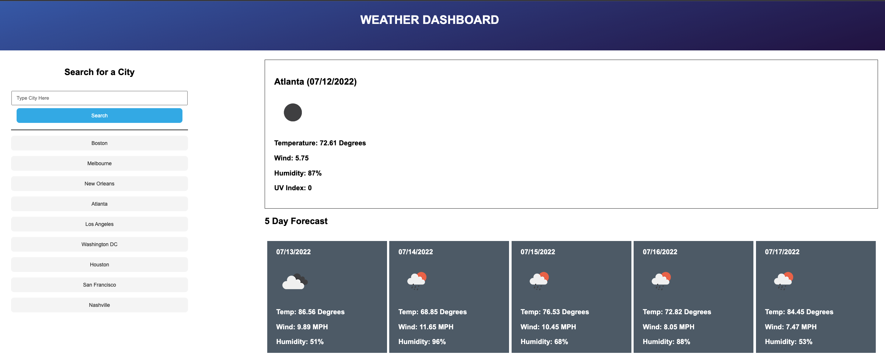

# Weather Dashboard Application

## Purpose
Create a weather dashboard with daily and upcoming weather information using the OpenWeatherMap API that uses localStorage for data persistence
## Screenshot

## Built With
* HTML
* CSS
* JavaScript
* OpenWeatherMap API
* Moment JS

## Website
https://matt-wiser.github.io/weather-dashboard/

## Contribution
Made by Matthew Wiser